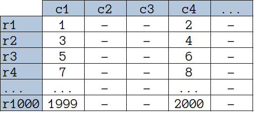
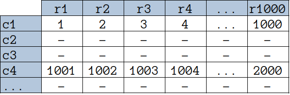
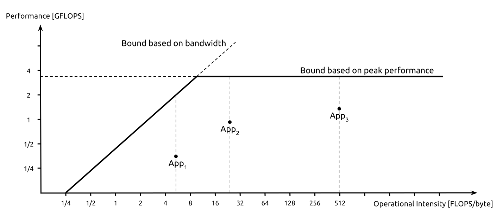

# Introduction To Software Performance Engineering

:::info A Note to Professors
During the first week of class, it is customary to spend some time discussing course logistics, setting expectations, adjusting the topic list, building community, outlining expectations for assignments and participation, etc.
Such discussions are necessarily highly tailored to the students, the course, and the institution.
Rather than clutter this document with material that is not relevant to *your* class, such content is omitted from this page, even though it is a necessary part of the first week of any academic class that teaches Software Performance Engineering.
:::

## Contact Information

This discussion summary was produced by the course instructor in Spring 2026, [Mike Spear](https://www.cse.lehigh.edu/~spear/#/).
Mike asks that you direct any questions or suggestions to him.

## Readings And Activities Before Class

None

## Getting Started

Imagine that you are a database administrator at a big company.
You probably administer several different databases.
If you were to think about just one, what would it look like?

- How many tables do you think your database would have?
- How many columns do you think each table would have?
- How many rows would each table have?
- How many pre-made SQL queries (e.g., views) would your company have?

It is likely that the database would have fewer than 100 tables.
Each of those tables might have hundreds of columns.
Each of those tables might have millions of rows.
There would probably be a few dozen different views.
Or, at least, there are probably only a few dozen "hot" views that run often.

Now let's drill down on those views a bit.
They probably each read a small fraction of the total number of columns.
But there are probably some views that return millions of rows.

The way that the database organizes the data can have a huge impact on performance.
For now, let's assume that the database does not fit in memory.
As a result, the behavior of the storage system (whether an SSD or a spinning disk) will be very important.

To understand why, let's begin by simplifying the data access pattern and visualizing it.
The following picture shows a table in the traditional *row-oriented* format.
The columns of a row are adjacent in memory.
One row occurs in full before the next row starts.
For the query `SELECT c1, c4`, the data elements that will be returned are represented by numbers `1, 2, ..., 2000`.



With the row-oriented layout, the elements you need to return are never adjacent to each other in memory.
This leaves you with three options.

1. You could change the order of the columns in the table, so this query would have fewer seeks.
   However, that would mess up the *other* queries in your database.
2. You could do lots of small reads, to skip over columns that you don't need.
   This would lead to lots of seeking, to do many reads per row, times the number of rows.
3. You could read entire rows, to avoid skipping.
   This could consume a lot of disk and memory bandwidth fetching data that you wouldn't need.

Now let's imagine that the data was organized in a *column-oriented* format.
All data for one column are adjacent in memory.
The first row of data for column $c_{i+1}$ would come immediately after the last row of data for column $c_{i}$.



Now if you wanted to read column $c1$ for all rows, the data would be adjacent in memory.
You could read it all without reorganizing, without any intermediate skipping, and without reading any extra data.

Let's be a bit more formal in the analysis.

- Let $R$ be the number of rows in the table, $C$ be the number of columns in the table, and $C' << C$ be the number of columns returned by a `SELECT` that returns every row
- With a row-oriented storage layout, you could expect to make $C' \times R$ small reads, or to do one big read that ingests $R\times(C-C')$ extra bytes.
- With a column-oriented storage layout, you could expect to make $C'$ large reads.

The column-oriented layout could be significantly faster!

Of course, in a real database, things are more nuanced.
There are many research papers and production systems that explore this tradeoff in more detail.
One example is [this paper](https://15721.courses.cs.cmu.edu/spring2016/papers/p967-abadi.pdf).

If the database was entirely in memory, then the same idea could be applied, using a general optimization idea known as structure splitting.
Again, there are many papers about this.
Here's [one](https://www.cs.rochester.edu/~cding/Documents/Publications/pldi04.pdf), if you're interested.

The point of this example is to show that when you start to consider specific workloads and specific hardware characteristics, it becomes possible to get amazing speedups by changing the code of the program.
It is also possible to explain those speedups mathematically.

How big is the impact?
Consider the number of queries that a large social media company might issue in a day, across all of its datacenters throughout the world.
If you sped up those queries by $20\%$, users would have a better experience, which would make them happier.
In addition, think about how much e-waste you would prevent.
Think about how many power plants worth of electricity might not be needed.
Think about how much less water would be needed for cooling the servers.
Think about how much money would be saved.

## Not All Programs Need Performance Engineering

It's dangerous to think that every program needs performance engineering.
Even among programs that do need performance engineering, knowing when to optimize is a challenge.
You've probably heard that "premature optimization is the root of all evil".
This is often attributed to [Tony Hoare](https://en.wikipedia.org/wiki/Tony_Hoare) and [Donald Knuth](https://en.wikipedia.org/wiki/Donald_Knuth).
If you are writing proof-of-concept code, then the speed with which you produce the proof of concept matters more than the speed at which that code runs.
If you are testing a hypothesis that is not performance-oriented, then optimizing code that produces a negative result is a huge waste of time!

There are quite a few other reasons why you may not want to optimize a program.
Some factors relate to social or business issues.
It might be a run-once (or run-rarely) script.
The critical bottleneck might be time-to-market.
The time spent developing might be a bigger issue than the time the program takes.
You might not have the money to pay for a programmer who has performance engineering skills.
Your code might be very brittle, in which case any edits could risk breaking something subtle.
Or, perhaps you don't have the budget to maintain the code if optimizing it makes it too complex.

There are also programs whose performance issues simply can't be known yet.
Perhaps there are issues with legacy I/O devices.
Maybe performance issues only show up when the program runs at scale.

Soon, we will discuss Amdahl's law, which observes that your optimization efforts will only improve a fraction of the program.
This can impact the decision to optimize in many ways.
One example is that in programs that rely on a slow run-time environment, performance engineering might not get you very far.
Another is that in programs that run in many different contexts, there might not be a single part of the program that you could improve in order to benefit many of the users.

Another tricky point is that some programs are slow because of interactive I/O.
Keyboards and mice typically have a latency of a hundred microseconds or more.
Network latency below 15 milliseconds is generally considered imperceptible.
It's debatable whether improving CPU and memory efficiency matters if a program is responsive within these bounds.

Of course, there's a counterargument to almost every one of these examples.
If a slow script is run in a loop 100 times, inefficiencies start to show.
If you want to train an AI to play your video game over a local socket, then network and keyboard latencies stop mattering.

The good news is that as you build skill in performance engineering, these questions get easier.
You'll become better at avoiding performance pathologies when you write code.
You'll build intuition about what programs need more performance.
And you'll develop a sense for where to look first when a program performs badly.

## How Do You Know That A Program *Needs* Performance Engineering?

This might seem like an easy trick question.
A program needs performance engineering if you are unhappy with its performance.
But it's possible that the program cannot be sped up, or that speeding it up would take some incredibly brilliant new algorithmic idea.
That's not performance engineering.
That's research.

So let's instead say that you need to be unhappy with the performance, and also have reason to believe that it could be made faster.
That takes some sophistication.
What are some reasons why performance might be bad?

- It could be that the behavior does not match published expectations (e.g., 1 $\mu{s}$ network latency, or 1m000 TFLOPS of GPU performance)
- There might be signals, like low latency and low throughput, to indicate that a resource is underutilized
- Maybe there are "[code smells](https://en.wikipedia.org/wiki/Code_smell)"

An important point is that it helps to think about *who* is runnig the program, *where* it is running, and *what workload* is expected.
This leads to some other possible reasons for bad performance, including:

- Slow user experience / poor responsiveness
- High energy costs
- Expectation that the workload will be running in multiple locations at once
- Concern that there could be bursty workloads, or that the scale at which the program runs will be growing
- Concerns about high resource utilization

Another way to think about it is that *any program* that runs at a large scale will have an opportunity cost if it is not optimized.

It is worthwhile to consider theoretical models of performance, if only briefly.
After all, if someone is paying you to make a program faster, you want to be able to show that you earned your pay!

One worthwhile model to explore is the [roofline model](https://en.wikipedia.org/wiki/Roofline_model).
A roofline model shows the priority for optimizing a program's use of different resources.
For example, in the image below, the diagonal portion of the curve shows that initially the program is spending its time waiting for data from memory.
Moving rightward on the x axis indicates that the program has been optimized to use the memory more effectively.
Continuing this line of optimization works for a while, because it means that the programmer doing a better job of providing the CPU with work to do.
The CPU isn't waiting, so performance goes up.
However, there is a point where the CPU becomes the constrained resource.
It simply cannot do more computation per unit time, no matter how much data is available.
At that point, performance flat-lines.
That may not mean that things cannot get better.
But it does mean that optimizing memory accesses won't matter until the CPU bottleneck is addressed.

<figure>
  
  <figcaption style="text-align: center;">Image By Giu.natale - Own work, CC BY-SA 4.0, https://commons.wikimedia.org/w/index.php?curid=49641314</figcaption>
</figure>

Another important idea is Amdhal's law.
This law is often used to discuss parallel performance, but it is more broad.
To understand Amdahl's law, first consider the basic speedup formula:

$$
speedup = \frac{time_{old}}{time_{new}}
$$

In simple terms, if the new execution time is half the old time, then the speedup would be two.

The key thing that Amdahl recognized is that *optimizations rarely affect all parts of a program equally*.
Consider a program that reads data, processes it, and writes it.
The original execution time comes from three parts:

$$
time_{old} = time_{read} + time_{process} + time_{write}
$$

The execution time after speeding up the processing time by a factor of $2$ would still come from three parts:

$$
time_{new} = time_{read} + \frac{time_{process}}{2} + time_{write}
$$

If $time_{process} = time_{old}/2$, then even if we had *infinite* speedup in processing, the whole program would only be $2\times$ as fast.

From this observation, Amdahl's law defines $f$ as the fraction of the program that can be sped up by an optimization, and $S_{part}$ as the speedup of that part of the program.
Given these definitions, when optimizing a part of a program, the overall program speedup will be:

$$
1/{(1-f)+(f/S_{part})}
$$

Simply put, there will be diminishing returns.
The more you optimize one part of the program, the less significant it becomes, and the less valuable it is to put more work into optimizing it.
It's good to note that this "law" can be violated if increases in scale lead to increases in $f$.
This is known as Gustafson's law.

## How Do You Know *What Is Causing* Bad Performance?

Once you've determined that you want a program to be faster, the next task is to determine where there's an opportunity to make improvements.
You could think of this as trying to identify the $f$ from Amdahl's law.

*Profiling* is the task of developing an understanding of where the time is spent in a running program.
This involves measurement.
Part of the challenge is that measuring a program can perturb its behavior.
Traditional profiling required re-compiling a program with special instrumentation, running the program, and then reading a special report that the profiled program would produce.
This is still important, but it's tricky, because it interrupts a running program and changes it.
The profiling instrumentation almost always slows the program down, too.

Modern CPUs have low-level hardware performance counters that can also aid with profiling.
They can report important events, like the number of L1 data cache misses, branch mispredictions, etc.
These statistics can be gathered without recompiling the program, though they often do require restarting the program.

Let's look at both techniques.

### Diagnosing Performance #1: Hardware Indicators

In this exercise, you will need to be able to compile C++ code in a Linux environment.
Though not strictly necessary, having a compiler that supports the C++20 standard is a good minimum.
Depending on your environment, you might also need root access to your machine.

Once you are ready, create a folder and download all of these files to it:

::: code-group
<<< @/week_01/perf/mm.cc{c++}
<<< @/week_01/perf/Makefile{Makefile}
:::

The code performs a dense matrix multiplication.
This has an $O(n^3)$ complexity, where $n$ is the number of rows in the matrix.
You can compile it by typing `make`.
When you run the code, you can specify the size of the matrices to multiply.
The code will generate two matrices of random numbers and multiply them.
Here's an example:

```text
$ make
[CXX] mm.cc --> obj64/mm.exe
$ ./obj64/mm.exe 100
Successfully multiplied two 100x100 arrays in 0.00145572 seconds.
$ ./obj64/mm.exe 1000
Successfully multiplied two 1000x1000 arrays in 1.07295 seconds.
```

Next, use the Linux `perf` tool to run the program:

```text
$ sudo perf stat -e L1-dcache-load-misses,LLC-load-misses ./obj64/mm.exe 1000  
Successfully multiplied two 1000x1000 arrays in 1.0991 seconds.

 Performance counter stats for './obj64/mm.exe 1000':

   <not supported>      cpu_atom/L1-dcache-load-misses/                                       
     1,025,564,742      cpu_core/L1-dcache-load-misses/                                         (98.97%)
            26,289      cpu_atom/LLC-load-misses/                                               (1.03%)
         9,974,792      cpu_core/LLC-load-misses/                                               (98.97%)

       1.122701148 seconds time elapsed

       1.109396000 seconds user
       0.012992000 seconds sys
```

There were **one billion** L1 data cache misses.
You can probably guess that one billion is very high.
After all, there are only on the order of a billion operations.
You should try to look at L2 dcache load misses.
You should also try to look at L1 and L2 store misses.

There are some relatively trivial changes you can make to this code that will make it run much faster.
In addition, those changes will lower the number of L1 data cache misses.
Take a moment to see what you can do.
Keep in mind that your changes cannot lead to the program becoming incorrect.

:::details Spoilers!
There is an easy way to boost the performance: change the order of the second and third loops.
However, it's not so trivial, because we initialize the `C` array along the way.
In order to reorder the loops, first we need to move initialization outside of the main body.
This raises a good question: do we need to time that part?
We're not going to worry about that question yet, because this is just the first week.
:::

### Diagnosing Performance #2: Software Indicators

Next, let's take a look at software profiling.
For this exercise, we'll use the `gprof` tool.
Gprof counts the number of times each function runs.
It also does statistical sampling to estimate which functions take the most time.

To use gprof, you need to recompile a program with the `-pg` flag.
Then, when you run the program, it will output a `gmon.out` file, which you can analyze using `gprof`.
Naturally, this means that gprof has modified your program, which could perturb its behavior.
Also, note that since gprof looks at function calls, your results might be strange if compiler optimizations are resulting in a lot of inlining.

The code for this example is a bit more complex.
You'll want to copy all of these files to a folder:

::: code-group
<<< @/week_01/gprof/bench.cc{c++}
<<< @/week_01/gprof/bench_thread_context.h{c++}
<<< @/week_01/gprof/config.h{c++}
<<< @/week_01/gprof/dlist_omap.h{c++}
<<< @/week_01/gprof/experiment.h{c++}
<<< @/week_01/gprof/logging.h{c++}
<<< @/week_01/gprof/manager.h{c++}
<<< @/week_01/gprof/Makefile{Makefile}
:::

This code implements a lightweight benchmark harness for testing concurrent data structure throughput.
We're only going to worry about single-thread performance for now.
When you run the program, it will do a series of randomly-selected insert/lookup/remove operations on a map data structure, using random keys and values.
Then it reports the throughput.

When you run gprof, you'll discover that an unexpected function is taking a lot of time.
Worse, that function's result is not even being used most of the time!

:::details Spoilers!
This is an artificial bug that I added to the benchmark code.
The crux of the problem is that we need to be careful in our assumptions about how smart the compiler is.
In this case, we've got a flag that determines whether logging should happen or not.
That seems like a good idea.
However, the code is using `std::format` to construct strings and pass them to the logging function.
The logging function is not being inlined.
This means that the compiler will construct the string and pass it to the function, even if the function won't print it.
It turns out that string construction is expensive!
This is true in other languages, too.
It can even happen in languages with JIT compilation, [like Java](https://blog.stackademic.com/the-hidden-performance-killers-a-deep-dive-into-javas-string-and-memory-allocation-407438b96933).

How should we fix this?

- If we made the logging a macro, it wouldn't be easy to turn it on and off, and compilation times would increase
- We could move the logging condition into the benchmark code, but that would be bad for maintainability
- We could make the logging function take a variable number of arguments, and then use `std::format` inside the logging function
  - But then we'd need to ensure that handling variadic arguments doesn't create extra overhead

In addition to giving a quick taste of how gprof works, this example illustrates the point that performance engineering can come at the cost of maintainability and readability!
:::

## Next Steps

Thus ends the notes page for the first week of our class.
There is an assignment coming out soon, and next week we will start having required readings before class.
Please be sure to play with perf and gprof, using the programs I provided as well as others of your choosing.
You should also try to follow some of the links from this document.
