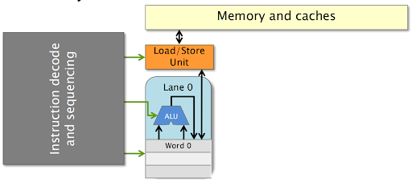
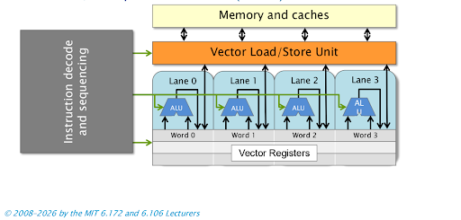
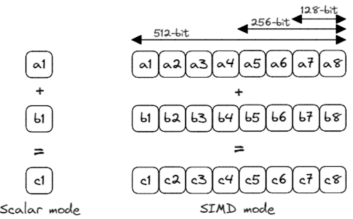
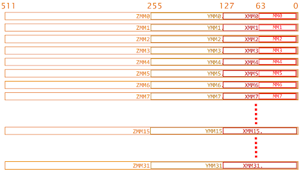
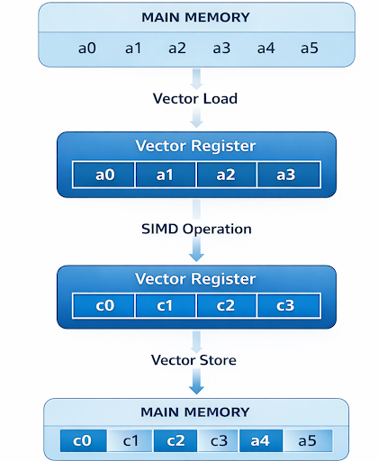
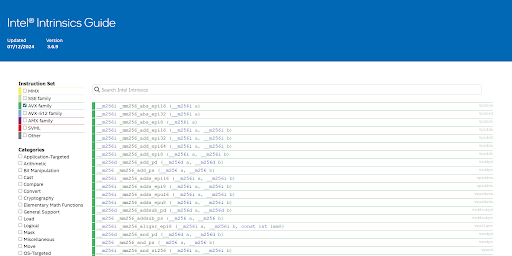
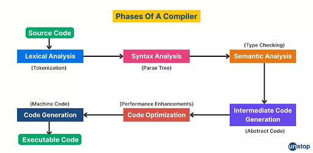
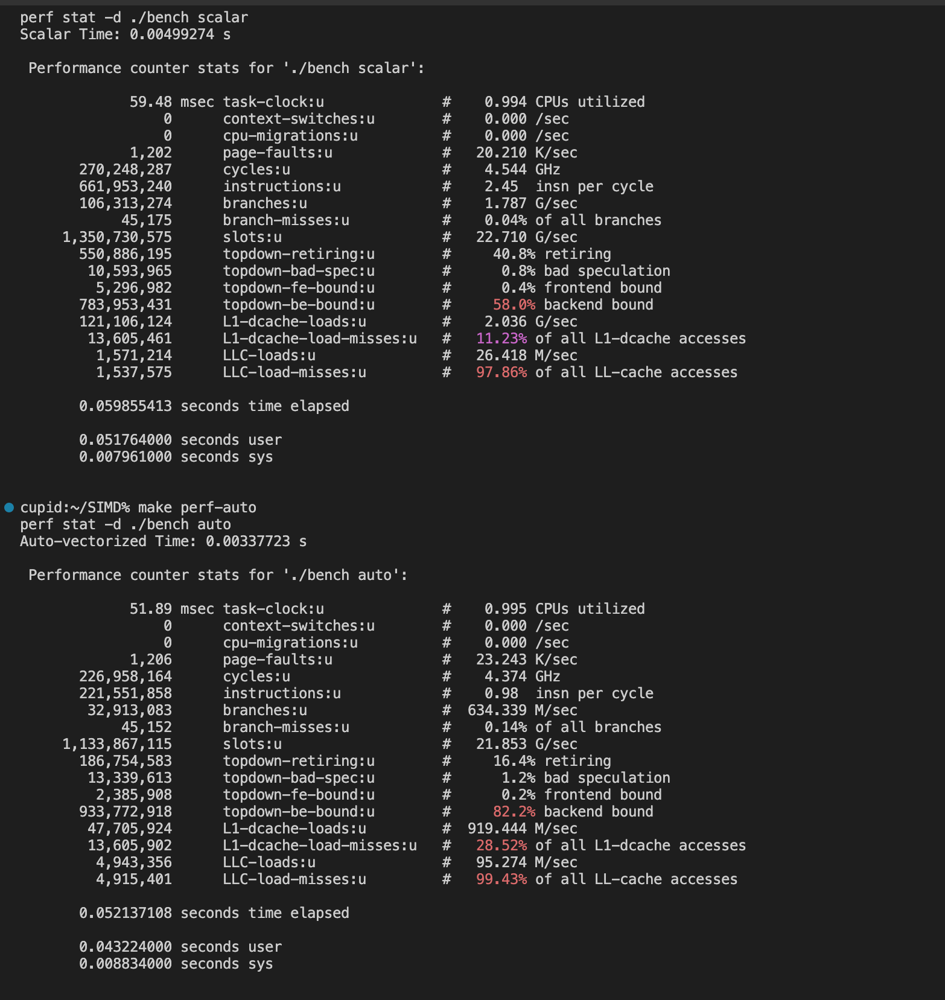
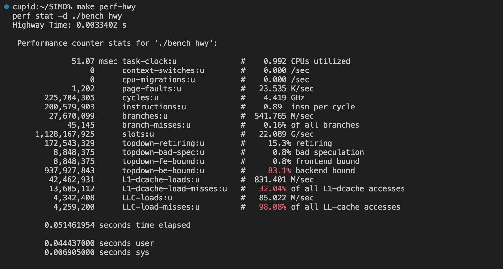

# Manual Instruction Selection, SIMD & Vectorization, and Compiler & Runtime System Impacts

## Contact Information
The materials in this discussion are summarized by:
 * Aabiskar Thapa Kshetri - aat226@lehigh.edu
 * Thi Tran - tnt227@lehigh.edu
 * Trang Tran - tmt227@lehigh.edu

## I. SIMD

### Introduction

SIMD, or *Single Instruction Multiple Data*, is a form of parallel computation where one instruction operates on multiple data values at the same time. Instead of processing values one-by-one like traditional scalar execution, SIMD uses vector registers to execute the same operation across several elements simultaneously. This allows modern processors to significantly improve throughput for workloads with large amounts of data parallelism.

Modern CPUs expose SIMD capabilities through specialized instruction sets. On Intel and AMD processors, SIMD evolved from MMX and SSE to AVX, AVX2, and AVX-512. ARM processors provide NEON and SVE/SVE2 extensions for similar functionality. As register widths increase, processors can operate on more data elements per instruction, improving computational throughput when workloads are well vectorized.

---

### Scalar vs. Vector Execution

Traditional scalar execution processes one value per instruction using general-purpose registers. SIMD execution instead uses wide vector registers capable of storing multiple values simultaneously.

#### Scalar Unit vs Vector Unit





For example, consider the following loop:

```cpp
double *a, *b, *c;

for (int i = 0; i < N; ++i) {
    c[i] = a[i] + b[i];
}
```

In scalar execution, the processor performs one addition during each iteration. With SIMD, multiple additions can be performed simultaneously using vector instructions. Instead of processing one element at a time, a vector register may process four, eight, or even sixteen elements in parallel depending on the instruction set and data type.

#### Vector Execution Example



This is the fundamental reason SIMD improves performance: fewer instructions are needed to perform the same amount of work.

|  | Scalar Execution | Vector Execution |
|---|---|---|
| Register Type | General-purpose | SIMD vector registers |
| Elements per Register | 1 | N |
| Operations per Cycle | 1 | Multiple parallel lanes |
| Cycles Required | N | Reduced significantly |

---

### Vector Registers and Vector Lanes

A SIMD register is divided into multiple vector lanes. Each lane processes an individual element of the vector independently, but all lanes execute under the same instruction stream and control signals. This is commonly referred to as *lock-step execution*.

#### Vector Registers



For example, a 256-bit AVX register processing 64-bit doubles contains four vector lanes. Each lane performs the same operation on a different data element simultaneously.

Although lock-step execution improves throughput, it also introduces limitations. If one vector lane encounters a cache miss, all other lanes typically wait until the stalled memory operation completes. Similarly, if one lane triggers an exceptional case such as divide-by-zero, the processor must handle that condition before the instruction can fully retire. Even though hardware supports masking and IEEE floating-point handling, one problematic lane can still reduce the efficiency of the entire vector operation.

---

### SIMD Memory Operations

SIMD execution relies heavily on efficient memory movement. A typical SIMD workflow consists of three stages:

1. Loading multiple values into vector registers
2. Performing arithmetic operations across all lanes simultaneously
3. Storing the results back to memory

#### SIMD Memory Pipeline



By reducing the number of load/store instructions and performing several operations in parallel, SIMD significantly improves computational efficiency. However, memory alignment and cache locality become extremely important. Misaligned accesses or poor spatial locality can quickly eliminate the expected performance gains.

---

### SIMD Intrinsics

Programmers can directly access SIMD instructions through compiler intrinsics.

A scalar implementation might look like this:

```cpp
void mul4_scalar(float* ptr) {
    for (int i = 0; i < 4; i++) {
        const float f = ptr[i];
        ptr[i] = f * f;
    }
}
```

Using SIMD intrinsics, the same computation becomes:

```cpp
void mul4_simd(float* ptr) {
    __m128 f = _mm_loadu_ps(ptr);
    f = _mm_mul_ps(f, f);
    _mm_storeu_ps(ptr, f);
}
```

The SIMD version loads four floating-point values at once, squares them in parallel, and stores the results back using only a few vector instructions. This reduces instruction overhead and increases arithmetic throughput substantially.

[Godbolt Compiler Explorer](https://godbolt.org/) is a useful tool for examining how different implementations are interpreted and optimized by the compiler. By inspecting the generated assembly code, you can better understand how SIMD interacts with memory and contributes to more efficient computations.

#### Intel SIMD Intrinsics

To write SIMD instructions for Intel processors, it is recommended to use Intel’s published [Intrinsics Guide](https://www.intel.com/content/www/us/en/docs/intrinsics-guide/index.html). It provides access to intrinsics for multiple SIMD instruction sets and vector widths.



---

### Limitations of SIMD

Despite its advantages, SIMD is not universally efficient. One of its biggest challenges is branch divergence. Since all lanes execute together, conditional branches can force some lanes to remain idle while others continue execution, reducing hardware utilization.

SIMD also struggles with irregular memory access patterns. Operations such as gathers, scatters, and indirect indexing often require additional instructions and increase memory latency. Unaligned memory accesses can force loads to span multiple cache lines, introducing stalls and reducing throughput.

Another challenge is portability. SIMD optimizations are often tightly coupled to a specific architecture or instruction set. Code optimized for AVX-512 may not map efficiently to ARM NEON or SVE. Additionally, debugging SIMD code is harder because many operations happen simultaneously within a single instruction stream.

# II. Manual Instruction Selection

### Compiler Auto-Vectorization

Modern compilers attempt to automatically convert scalar loops into SIMD instructions through a process known as auto-vectorization.

This process typically involves three stages:

1. Determining whether vectorization is legal
2. Estimating whether vectorization is profitable
3. Transforming scalar code into vectorized machine instructions

To safely vectorize a loop, the compiler must prove that iterations are independent and free from unsafe dependencies. It also needs to determine whether vectorization will actually improve performance. If successful, the compiler rewrites the loop using SIMD instructions while generating additional logic for remainder handling and alignment checks.

However, auto-vectorization is fragile. Small refactors, compiler changes, or inlining decisions can silently disable vectorization. A seemingly harmless modification may change the compiler’s dependency analysis and completely alter the generated machine code without warning.

---

### Why Vectorization Is Difficult

Vectorization is fundamentally challenging because the compiler must preserve correctness while attempting to expose data-level parallelism.

Several issues commonly prevent successful vectorization:

- Pointer aliasing
- Loop-carried dependencies
- Floating-point non-associativity
- Data-dependent branches
- Irregular memory access patterns

Compilers also lack runtime information such as branch probabilities and exact loop trip counts. As a result, the compiler may conservatively avoid vectorization even when vector execution could potentially improve performance.

---

### Data Layout and Scalar Packing

SIMD performance depends heavily on memory layout.

Vector loads are most efficient when data is aligned to the register width. For example:
- SSE prefers 16-byte alignment
- AVX prefers 32-byte alignment
- AVX-512 prefers 64-byte alignment

A Structure of Arrays (SoA) layout is generally preferred over an Array of Structures (AoS) layout because similar values are stored contiguously in memory.

```text
AoS: {x, y, z, x, y, z, ...}

SoA: {x, x, x, ...,
      y, y, y, ...,
      z, z, z, ...}
```

Contiguous layouts improve spatial locality and allow vector loads to operate efficiently without expensive gather operations.

---

### Shuffle Operations

Although SIMD arithmetic is fast, rearranging data inside vector registers can be surprisingly expensive.

Operations such as gathers, scatters, lane permutations, and horizontal reductions often require additional shuffle instructions. SIMD hardware is optimized primarily for vertical element-wise operations, not cross-lane communication.

As a result, workloads with heavy shuffle requirements may actually perform worse than scalar implementations. This is one reason compilers perform profitability analysis before deciding to vectorize a loop.

# III. Compiler and Runtime System Impacts

### Compiler Responsibilities

SIMD hardware alone does not guarantee performance improvements. The compiler plays a critical role in identifying parallelism, transforming loops, selecting instructions, and optimizing memory behavior.

#### Compiler Pipeline



Consider the following loop:

```cpp
for (int i = 0; i < n; i++) {
    ptr[i] *= ptr[i];
}
```

This loop is vectorizable because each iteration is independent. However, vectorization may fail if the compiler cannot prove memory independence or alignment guarantees. Pointer aliasing, branching, and unknown data dependencies frequently prevent successful vectorization.

---

### Wider SIMD Does Not Always Improve Performance

Although wider SIMD instructions increase theoretical throughput, they do not always improve real-world performance.

If workloads cannot fully utilize all vector lanes, much of the hardware remains idle. In many applications, memory bandwidth and cache latency become the dominant bottlenecks before arithmetic throughput is fully utilized.

Wider SIMD instructions may also trigger frequency throttling. For example, AVX-512 workloads can reduce CPU clock frequency because of increased power and thermal demands. This means wider vectors do not automatically translate into proportional speedups.

---

### Runtime System Effects

Runtime behavior strongly affects SIMD efficiency.

Even highly optimized SIMD code may spend much of its execution time waiting for memory accesses to complete. Important runtime factors include:
- Cache hierarchy behavior
- Thread scheduling
- NUMA placement
- Memory allocation
- Context-switch overhead

In many workloads, memory latency becomes the primary performance bottleneck rather than arithmetic throughput itself.

---

### Portable SIMD Libraries

Libraries such as [Highway](https://github.com/google/highway) provide portable SIMD abstractions across multiple architectures while still allowing explicit vector programming.

These libraries support runtime dispatch, architecture portability, and explicit SIMD operations without requiring developers to manually rewrite code for every processor architecture.

However, even perfect SIMD code can still perform poorly if runtime behavior, cache locality, or memory scheduling are unfavorable. Ultimately, runtime systems determine how effectively hardware resources are utilized.

---

### Benchmark Analysis

Benchmark results show that SIMD improves computational throughput but also increases backend pressure due to memory bottlenecks.

#### Performance Benchmark Results





| Version | Time | IPC | Backend Bound |
|---|---|---|---|
| Scalar | 0.00499 | 2.45 | 58% |
| Auto-vectorized | 0.00337 | 0.98 | 82% |
| Highway SIMD | 0.00334 | 0.89 | 83% |

SIMD achieves roughly a 1.5× speedup, but Instructions Per Cycle (IPC) decreases significantly because the workload becomes increasingly memory-bound. SIMD executes more work per instruction, meaning fewer instructions occur between cache misses. As a result, backend stalls dominate execution time.

---

### Runtime Dispatch

Different processors support different SIMD instruction sets, so software often uses runtime dispatch to dynamically select the best implementation available.

At startup, programs may query CPU capabilities using CPUID and choose between implementations such as:
- Baseline x86
- AVX2
- AVX-512

Runtime dispatch improves portability and performance across different machines, but it also introduces overhead through indirect branches, larger binaries, and increased maintenance complexity. For small functions, dispatch overhead itself may become measurable.

---

### Runtime Environment and OS Interaction

The operating system also impacts SIMD execution.

During context switches, the kernel must save and restore vector register state using mechanisms such as XSAVE and XRSTOR. Wider vector registers increase the amount of architectural state that must be preserved, increasing overhead during scheduling.

Standard libraries such as `glibc` also use runtime dispatch internally for optimized implementations of functions like `memcpy` and `strlen`.

Additionally, processors may dynamically reduce clock frequency during heavy AVX-512 workloads due to thermal and power-management constraints. SIMD performance is therefore influenced not only by software optimization, but also by hardware-level policies and runtime system behavior.

---

### Memory Layout and Performance Impact

Memory layout has a major impact on SIMD efficiency.

Contiguous, aligned data stored in cache allows SIMD instructions to achieve near-peak throughput. In contrast, irregular layouts, gathers, stride-based access patterns, and unaligned memory accesses introduce significant overhead.

For example:
- SoA layouts generally maximize SIMD efficiency
- AoS layouts often require expensive gather operations
- Stride-based accesses reduce spatial locality
- Cross-cache-line loads increase memory latency

In many SIMD workloads, memory behavior ultimately determines overall performance more than arithmetic throughput itself.