# Network Systems Optimizations 

# Lecture 1: Traditional Networking Optimizations
*CSE 498 — Alex Clevenger, Rishad Islam, Reilly Yankovich*

## Definition: Network protocols
Network protocols are an established set of rules for computers to communicate and transfer data with each other. Different layers of a network use different protocols to communicate; for example, the protocol for communication between computers over the internet is different than within a server farm. Here, we will focus on two specific protocols: User Datagram Protocol, or UDP, and Transmission Control Protocol, or TCP. We will also briefly discuss some general optimizations when networking.

## General optimizations
In general, when programming over a network, you want to *properly saturate* the network cards. As in, you want to be sending enough messages that you’re efficiently using the networking capabilities of your network, but not sending too many messages such that you’re exceeding the capabilities. If you send too few messages, not efficiently using the capabilities of your network, that’s called *under-saturating*. If you send too many messages and overwhelm your network, that’s called *over-saturating*. Typically, in any properly large network, the bigger problem is over-saturating, because you can always send more messages if you’re under-saturating, so we will focus on that side of general optimizations.

* **Send fewer messages:** the more messages that have to be exchanged between systems, the more time is spent both sending and processing messages, and the less time is spent actually doing work. By batching numerous smaller messages together into one larger message, you are able to transfer the same amount of data in fewer messages, thereby spending less time networking. All networks have a *Maximum Transmission Unit,* or MTU, which is the maximum number of bytes that can be transmitted with a single message. Over Ethernet, this is typically **1500 bytes**, and over IPV6 it’s typically **1280 bytes.** If you have a message that’s only 20 bytes long, that means you can fit several dozen into a single MTU by batching, without any modifications made to the network!
* **Think about your topology:** Networks are generally organized into a *topology,* which is how connections are made and organized between systems. One example of this is a *ring topology:* every system has one receiving connection and one sending connection. The final network connects to the first network, causing a “ring” to form: system 1 sends to system 2, which sends to system 3, which sends back to system 1.
There are several different topologies commonly used, sometimes in conjunction with each other to form a hybrid topology, and they all have their pros and cons; continuing with the ring topology example, there are very few connections that have to be formed, but this results in messages having to go around the ring. If system 2 only sends to system 3, but it needs a message to get to system 1, it has to go *all the way around the ring* to get back to system 1.
All this to say, if you don’t plan your message passing around your topology, you could be doing a lot more work than necessary. If you have a ring topology, it may be far more efficient to batch several messages going to several different systems to avoid passing through the ring multiple times. In a *mesh topology,* where every system is connected to every other system, it makes more sense to batch several messages going to the same system, because any system is able to transmit to any other system.
* **Do load balancing:** If one specific system is overloaded in a network, it could slow down every other system in the network. This is because the longer that one system takes to perform tasks, the longer it takes for all other systems to receive confirmation from that system for *their* remote tasks. This is especially true in a ring or tree topology, for example: if one system is overloaded, no messages are getting past that system until it can catch up.
To avoid this, split up the network traffic between systems. If you have a database, replicating data across different systems means that you can route traffic to different replicas, alleviating pressure. Forming a hybrid topology could reduce network traffic by allowing a second path to reach a specific destination (in a ring topology, for example, just having connections going the other direction can allow routing around a stalled/overloaded system). This can be taken further by applying *network segmentation:* have several sub-networks that are connected with one topology, and then those sub-networks are connected to other sub-networks with a separate, possibly identical, topology.  Rings within rings, rings within mesh, and so on. This allows a network to control traffic further than a simple topology.
Finally, analyzing your network traffic will show which systems need to be further alleviated, and if they always need to be alleviated. For example, in a multiplayer video game, you may expect less traffic during the average workday and more traffic during the evening. The servers for that game would need more resources dedicated to it during the evening, but during the day they might be used for some other purposes.

## UDP
User Datagram Protocol, or UDP, is a lightweight network protocol designed to have minimal overhead. There are no headers attached to messages, which are used by TCP to establish the order of packets; if a message in UDP spans multiple packets, those packets can be delivered out of order, delivered partially, or not delivered at all. This is especially true if two messages are sent at the same time. No connections are formally established when using UDP, meaning that no acknowledgements are sent back to you when sending a UDP packet. When using UDP, you don’t actually know when, or even if, a message gets delivered to the remote machine.
With these drawbacks, why would you ever want to use UDP? Well, since UDP has minimal overhead, it is ideal for cases where **speed is more important than correctness or reliability.** UDP is used for things such as video streaming, VPNs, or unreliable broadcasts in distributed systems. In all of these cases, a single dropped or corrupted packet here or there won’t affect the overall system; either that packet can be completely ignored, or it can be retrieved faster if it’s really important to include.

## UDP Example
Now, we will show a very simple example of using UDP. This example will open a server and client, and allow you to send messages from the client to the server.
For this example, you will want a terminal with netcat installed. Netcat is installed by default on all linux systems, so WSL and MACs should also have them installed by default.
If using two separate systems, then you will need to know the IP of at least one of the systems. Otherwise, you can use two terminals on one system, and use a *loopback IP.* A loopback IP is simply an IP that is used for a machine to talk to itself.
* **Step 1:** if you need the IP of the second machine, open a terminal and use `ifconfig` to find the IP, under “inet.” You can also do this to find a loopback IP if needed. **All IPs between 127.0.0.1 and 128.0.0.0 are enabled loopback IPs by default,** and these should work.

<a id="ifconfig_example"></a>
<p align="center">
  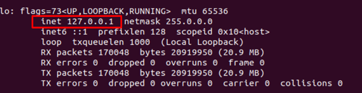
  <br>
  <em>Using ifconfig to find an IP. "inet" is what you're looking for.</em>
</p>

* **Step 2:** enter `nc` to ensure you have netcat installed. If you get a “usage” prompt like what is pictured below, you’re good.

<a id="nc_example"></a>
<p align="center">
  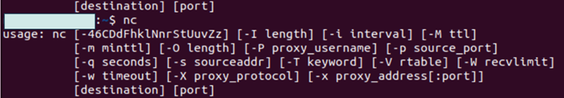
  <br>
  <em>Seeing if netcat is installed.</em>
</p

* **Step 3:** open a second terminal. If using 2 separate systems, you will want a terminal on each; if using loopback, then 2 terminals on the same machine will work.

* **Step 4:** pick one of the terminals to be the server. On this server side, enter:

```bash
$ nc -u -l <port> # choose a port
```

For port, any number should ideally work, but you might want to stick to a 4 digit number just in case. For example, 1234.
The flag `-u` is telling netcat to use UDP protocols, and the flag `-l` is telling netcat to listen for anything happening on the port we enter. So, all together, `start netcat using UDP, and listen on port <port>.`

* **Step 5:** On the other terminal, enter:

```bash
$ nc -u <ip> <port> # same port
```

Now, we’re telling our client to `start netcat using UDP, and send any following messages to <ip> over port <port>.`

* **Step 6:** On the client side, type whatever you want and hit enter. You should see that mesasge pop up on the server side.

**Congratulations!** You've now used UDP! Try sending extremely long messages, and seeing if everything actually gets sent. Over loopback this is pretty likely, but over an actual network packets stand a greater chance of dropping.

## UDP Optimizations
So, now that we’ve used UDP and know what to use it for, how can we improve it? The two broad categories of optimizations we can make to UDP are OS tweaks and smarter programming. If you’re using someone else’s network, you may be unable to perform the OS tweaks, but you can always program smarter!

* **OS tweaks:** Here, there are three optimizations we wish to highlight. More exist, but since they are not OS-specific, we only want to mention a few. These tweaks are all fitting into our general goal of properly saturating the network card.
  * There are two OS buffers that are used by UDP in the linux kernel: Receiving Memory, or RMEM, and Writing Memory, or WMEM. The RMEM buffer stores packets that have been received by the system, but have not yet been used by any application. WMEM is the opposite; it stores packets that have been written by an application, but have not yet been sent over a network. By adjusting these buffer sizes, the OS has more room to store packets before it has to drop packets.
  * When opening a socket for networking applications, you can set the socket to be *non-blocking.* This allows for packets to be transferred faster. If a system is already experiencing too much traffic, it might be beneficial to not do this, but having non-blocking packets is generally a good thing for UDP.
  * You can enable *packet aggregation,* which allows the kernel to automatically join several smaller packets into one transmission unit. This is like batching mentioned before, but done automatically by your OS.
* **Smarter Programming:** Smarter programming, in this case, means to remember the MTU, and to properly saturate the network card.
  * Since UDP doesn’t guarantee that all packets will be sent in the correct order, we want to minimize the chance that there’s an error. If we send a message smaller than the MTU, then the message will either be fully delivered or not delivered at all; packets won’t be sent in the wrong order, nor will a message be partially sent.
  * If you are unable to enable packet aggregation in your network, but you’re sending several small messages, you can just batch messages yourself. This has been mentioned before for the purpose of not over-saturating the network card, but in UDP, where messages aren’t guaranteed to all be sent, this is especially important. While this means that losing that single message is more costly, sending a single, batched message lowers the chance of losing anything compared to several unbatched messages.
  * On the receiving end of UDP messages (such as a server), parallelizing your message handling is a great way to improve your system. Parallelizing allows you to process messages faster, meaning there’s a lower chance of over-saturating the network card.

## TCP
TCP is the more reliable sibling of UDP. When using TCP, a connection between the two servers is formally established. This connection, and all following messages, use the 3-way handshake of TCP: Send, acknowledge, and second acknowledge. With this 3-way handshake, when a message is sent, an acknowledgement is sent back to let the sender know that the message is properly received, and the second acknowledgement means that both sides now know that a message was properly transferred. If either side does not receive its acknowledgement, it will re-send its piece of the puzzle; if the sender doesn't receive the first acknowledgement, it will *re-send the message,* and if the receiver doesn't receive the second acknowledgement, it will *re-send its acknowledgement.*

**This is the key difference between TCP and UDP:** with UDP, we don't know if a message was ever sent, much less if it was sent correctly; with TCP, *we make sure it was sent correctly.* In order for the receiver to know that a message was fully and correctly received, a message's packets include a header, which shows which message it is a part of, which "number" packet it is (for example, 1 of 4), and some other flags and checksums to ensure that the packet was not corrupted. With these, the receiver is able to see if any packets are missing (for example, if you have a message spanning 4 packets, and you have packets 1, 2, and 4, you know you're missing 3), use the checksum to check for corruption, and separate two message's packets in order to not mix them up.

In a linux-based system, using TCP is treated the same as reading and writing locally to a file on disk, except the file is a *socket.* Otherwise, it is basically identical from the user's side, including an expensive context switch to kernel space; the only difference is the operating system writes to the buffers in the network card instead of to an actual file. Although opening a socket is more complex than opening a file, this still allows for a very programmable, intuitive way to network, without having to deal with all the messiness of *actually* dealing with the network card.

With the 3-way handshake causing any message to be tripled at the minimum (send the message, receive the acknowledgement of the message, and send a second acknowledgement), TCP is, understandably, *slower than UDP.* Therefore, it is commonly used in cases where **correctness or reliability are more important than speed.** Some examples of these cases include SSH, file transfers, and web browsing.

## Comparison between TCP and UDP
We can use the `iperf3` tool, which operates similarly to the `perf` utility in Linux, to test and monitor the performance of different network protocols and configurations. This tool enables us to compare crucial performance metrics—such as network bandwidth, latency, and jitter—between TCP and UDP. To execute this comparison, we follow these steps:

```bash
$ iperf3 -s # Start the server
$ iperf3 -c <server_ip> # Benchmark TCP from client
$ iperf3 -c <server_ip> -u -b <bandwidth_limit> # Benchmarking UDP from client
```

The TCP benchmark is designed to determine the maximum available throughput (goodput) for that specific network path. For the UDP benchmark, we must explicitly set a bandwidth limit (`-b`), which forces the client to send network packets at the user-specified rate regardless of prevailing network conditions. The server, however, will only process incoming network packets up to its maximum capacity. This allows the benchmark to accurately measure packet loss. In our setup, we performed the benchmark from a local machine to a Lehigh Campus machine, routed over the Lehigh VPN.

<a id="tcp_benchmark"></a>
<p align="center">
  
  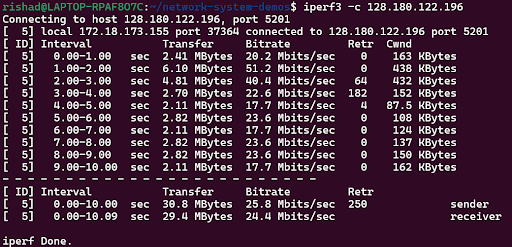
  <br>
  <em>Figure 1: TCP benchmark with iperf3</em>
</p>

Reviewing the TCP benchmark results ([Figure 1](#tcp_benchmark)) shows several expected behaviors of the TCP protocol. The recorded network throughput for the sender was 25.8 Mbps, while the receiver had 24.4 Mbps. This variance between the sending and receiving bitrates occurs because TCP actively probes the network's capacity using congestion control algorithms and occasionally encounters dropped packets. As the output indicates, there were packet losses during transmission; however, TCP's built-in retransmission mechanisms successfully identified these errors and guaranteed reliable, in-order delivery. Consequently, TCP naturally throttled itself to match the Network bandwidth.

<a id="udp_benchmark"></a>
<p align="center">
  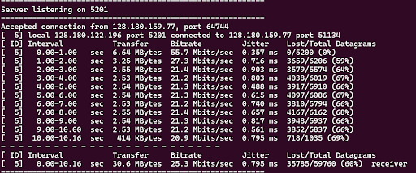
  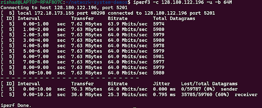
  <br>
  <em>Figure 2: UDP benchmark with iperf3</em>
</p>

For the UDP benchmark ([Figure 2](#udp_benchmark)), our objective was to stress-test the network system to determine if higher throughput could be forcibly achieved. To do this, we aggressively set the bandwidth limit to 64 Mbps. As a result, the client continuously transmitted at a rate of 64 Mbps, even though the established capacity of the network and the server was significantly lower (approximately 25 Mbps, as established by the prior TCP benchmark).

Because UDP lacks flow control and congestion control mechanisms, the client did not scale back its transmission rate. Consequently, the server's receiving rate saturated at 25.3 Mbps. This difference between the sending rate and the link capacity caused network congestion, resulting in a high volume of packet loss during transmission. The server successfully received only 60% of the packets, while the remaining 40% were lost due to buffer overflows at the sender, intermediary VPN routers, or the receiver. Because of the inherently connectionless and unreliable nature of UDP, there is no mechanism to recover these dropped packets.

The key observation from these benchmarks is that instructing a protocol to transmit faster does not bypass physical network constraints. Even if we attempt to achieve higher throughput by flooding the network with UDP packets, the underlying system limitations will not allow us to overcome the bottleneck. TCP elegantly handles this limitation by dynamically adapting its window size to the available bandwidth, whereas UDP simply drops the excess data.

## TCP Protocol Challenges
While TCP guarantees reliable, in-order delivery of data, these strict guarantees inherently introduce performance overhead, making it slower and more resource-intensive compared to UDP. Below, we analyze the reasons why TCP experiences reduced performance:
* **Protocol Overhead and Larger Headers:** To maintain the reliability of TCP, the protocol requires significantly larger packet headers compared to UDP. This additional metadata—which includes sequence numbers, acknowledgment numbers, and checksums—helps the receiver check for transmission errors and coordinate retransmissions if any data is corrupted or lost.
* **Connection Establishment:* Unlike UDP, TCP is a connection-oriented protocol. It requires a three-way handshake (*SYN $\rightarrow$ SYN-ACK $\rightarrow$ ACK*) before any data can be exchanged. This mandatory handshake introduces a delay of at least one full Round Trip Time (RTT) just to open the socket.
* **Head-of-Line (HOL) Blocking and Retransmission:** Because TCP guarantees strict in-order delivery, the loss of a single packet halts the processing of the entire stream. If one packet is dropped, all subsequent successfully received packets are buffered and blocked in the operating system's queue until the lost packet is successfully retransmitted and acknowledged.
* **Security Vulnerabilities and Mitigation Costs:** The stateful nature of TCP and mechanisms like HOL blocking introduce security risks. Malicious actors can exploit these features to launch Distributed Denial of Service (DDoS) attacks or exploit the three-way handshake to launch SYN flood attacks. Implementing mitigations against these attacks consumes additional computational resources and impacts overall network performance.
* **Congestion Control Mechanisms:** TCP continuously monitors the network to avoid collapse. A new connection starts sending data slowly (known as "Slow Start") to probe the network's capacity rather than overwhelming it. If a dropped packet occurs, TCP interprets this as network congestion and aggressively reduces its sending rate, which temporarily reduces throughput.
* **Bandwidth-Delay Product (BDP) Bottlenecks:** Maximum throughput over high-latency, long-distance links is often bottlenecked by the receiver's window size. Unless TCP Window Scaling is properly configured, the sender may be forced to sit idle waiting for acknowledgments before it can transmit more data, preventing the connection from fully utilizing the available bandwidth.
* **Nagle's Algorithm Latency:** To reduce the overhead of sending numerous tiny packets, TCP implements Nagle's algorithm by default. This algorithm buffers small chunks of outgoing data until a larger maximum-sized packet can be formed or an acknowledgment is received. While this improves bandwidth efficiency, it introduces artificial latency that harms real-time applications.
* **Bufferbloat:** In modern networks, excessively large, unmanaged buffers in intermediary routers can trap TCP packets. This phenomenon, known as bufferbloat, causes queuing delays and disrupts TCP's congestion control algorithms, leading to high latency spikes.

## Examples
We have two programs to show the use of TCP. While subsequent sections will detail specific optimizations to improve their performance, these examples establish our baseline. All the experiments were performed in the CSE Sunlab Machines.

Both of our examples use the POSIX socket API to establish reliable TCP communication. The general lifecycle of these TCP applications follows a pattern:
* **Server Setup:** The server creates a socket using the `socket()` system call, binds it to a specific port using `bind()`, and opens it for incoming connections using `listen()`. It then blocks execution at the `accept()` call until a client attempts to connect.
* **Client Setup:** The client similarly creates a `socket()`, but instead of binding, it uses the `connect()` system call to initiate the three-way handshake with the server's IP address and port.
* **Data Exchange:** Once connected, both applications use standard `send()` and `recv()` system calls to push and pull byte streams across the network.

### Bulk Transfer
The objective of a bulk transfer is to push a continuous stream of data from the client to the server. To achieve this, the client allocates a 1 KB buffer and enters a loop, repeatedly calling `send()` until the entire 1 GB target payload is transmitted. Conversely, the server sits in a `recv()` loop, continuously reading the incoming byte stream from the socket buffer until the client gracefully closes the connection.

```cpp
// Basic TCP Bulk Send Loop (Client)
size_t total_chunks = TARGET_DATA_BYTES / TCP_CHUNK_SIZE;

for (size_t i = 0; i < total_chunks; i++) {
  size_t bytes_sent = 0;
  while (bytes_sent < TCP_CHUNK_SIZE) {
    ssize_t result = send(sock, buffer.data() + bytes_sent, TCP_CHUNK_SIZE - bytes_sent, 0);
    if (result <= 0) {
      log_error("Send failed:", errno);
      return;
    }
    bytes_sent += result;
  }
}
```
```cpp
// Basic TCP Bulk Receive Loop (Server)
long total_bytes = 0;
while (true) {
  int bytes_read = recv(client_socket, buffer, sizeof(buffer), 0);
  if (bytes_read == 0) {
    // Client closed connection gracefully
    break;
  } else if (bytes_read < 0) {
    std::cerr << "Receive failed\n";
    break;
  }
  total_bytes += bytes_read;
}
```
<a id="bulk_transfer_1"></a>
<p align="center">
  
  
  <br>
  <em>Figure 3: Bulk Transfer of 1 GB Data Using TCP</em>
</p>

The initial benchmark successfully transferred 1024 MB of data in approximately 9.19 seconds. This shows a throughput of 934.249 Mbps, which indicates TCP saturates the network bandwidth once the connection is established when transferring a continuous stream of data.

### RPC Workload
Remote Procedure Call (RPC) workload tests the network's latency through a synchronous request-response model. The client sends a small 32-byte struct containing a sequence ID and payload. It then immediately blocks on a recv() call, waiting for the server to process the message and echo a response back. The server reads the incoming struct, modifies it, and uses send() to return it to the client. This interaction happens strictly sequentially.

```cpp
// Basic TCP RPC Loop (Client)
for (uint32_t i = 0; i < TOTAL_TRANSACTIONS; i++) {
  request.sequence_id = i;
  
  // Send the request
  send_request(sock, &request, sizeof(SmallMessage));
  
  // Block and wait for the synchronous response
  recv_request(sock, &response, sizeof(SmallMessage));
  
  // Validate
  if (response.sequence_id != i) {
    std::cerr << "Sequence mismatch!\n";
    return;
  }
}
```
```cpp
// Basic TCP RPC Loop (Server)
while (true) {
  // Block until a request is received
  if (!recv_request(client_socket, &request, sizeof(SmallMessage))) {
    break; // Connection closed or error
  }

  // Process the data
  response.sequence_id = request.sequence_id;
  memset(response.payload_data, 1, sizeof(response.payload_data));
  
  // Send the response back immediately
  if (!send_request(client_socket, &response, sizeof(SmallMessage))) {
    break;
  }
}
```
<a id="rpc_1"></a>
<p align="center">
  
  <br>
  <em>Figure 4: 100K RPC Workload Using TCP</em>
</p>

The benchmark executed 100,000 transactions in 17.2006 seconds. The system achieved a throughput of 5813.75 Transactions Per Second (TPS) with an average latency of 0.172006 ms per round-trip. Because each transaction requires a full round-trip across the network before the next can begin, this workload is heavily bottlenecked by the inherent latency of the TCP protocol and OS kernel processing, rather than raw bandwidth.

## TCP Optimizations
While TCP provides reliable delivery, its default configuration is tuned for general-purpose internet traffic, prioritizing bandwidth conservation and fairness over extreme low latency or maximum throughput. By adjusting specific socket options and application-level behaviors, we can optimize TCP for high-performance network applications.

### Socket Options for Low Latency
* **`TCP_NODELAY` (Disabling Nagle's Algorithm):** Nagle's algorithm is a congestion control mechanism which bundles multiple small, outgoing data packets into a single, larger packet before sending. While efficient for bandwidth, it introduces latency by delaying transmission  until a full packet is formed or an acknowledgment is received. For real-world applications requiring immediate data dispatch this delay is counterproductive. We can disable Nagle's algorithm for the client using the TCP_NODELAY socket option to ensure packets are transmitted immediately.

```cpp
// Optimization: Disable Nagle's algorithm on the sending socket
int opt_nodelay = 1;
if (setsockopt(sock, IPPROTO_TCP, TCP_NODELAY, &opt_nodelay, sizeof(opt_nodelay)) < 0) {
  log_error("setsockopt(TCP_NODELAY) failed:", errno);
}
```

* **`TCP_QUICKACK` (Disabling Delayed Acknowledgments):** By default, TCP delays sending an acknowledgment (ACK) for up to 40-500 milliseconds, attempting to piggyback the ACK onto an outgoing data packet. To combat this, we disable delayed acknowledgment for the server, ensuring ACKs are sent immediately. This directly reduces response time  in request-response loops. Note that on Linux systems, `TCP_QUICKACK` is not permanent and must be re-applied to the socket after subsequent read operations.

```cpp
// Optimization: Disable delayed ACKs for the incoming packet
// This must be set on the active client_socket, and reused after every read
int quickack = 1;
setsockopt(client_socket, IPPROTO_TCP, TCP_QUICKACK, &quickack, sizeof(quickack));
```

* **Buffer Sizes (`SO_RCVBUF` / `SO_SNDBUF`):** The operating system maintains memory buffers for unacknowledged outgoing data and unprocessed incoming data. Modifying these properties configures socket buffer sizes to optimize for specific network conditions and workload patterns. For bulk data transfers over high-speed links, default OS buffers are often too small, which prevents TCP from effectively scaling its window size.

```cpp
// Optimization: Increase Receive Buffer Size (4 MB)
// Must be done before listen() so Window Scaling is negotiated correctly
int rcvbuf = 4 * 1024 * 1024; 
if (setsockopt(server_fd, SOL_SOCKET, SO_RCVBUF, &rcvbuf, sizeof(rcvbuf)) < 0) {
  log_error("setsockopt(SO_RCVBUF) failed:", errno);
}
```

We applied this optimizations to our TCP bulk transfer and RPC benchmarks.

<a id="bulk_transfer_2"></a>
<p align="center">
  
  
  <br>
  <em>Figure 5: Bulk Transfer of 1 GB Data Using TCP with Socket Optmizations</em>
</p>

<a id="rpc_2"></a>
<p align="center">
  
  <br>
  <em>Figure 6: 100K RPC Workload Using TCP with Socket Optmizations</em>
</p>

The unoptimized bulk transfer successfully saturated the network at ~934 Mbps. After applying the buffer size optimizations (`SO_RCVBUF` and `SO_SNDBUF` set to 4 MB), the transfer completed in 9.20524 seconds with a throughput of 933.157 Mbps. The lack of performance improvement indicates we already satuarted the network with the default buffer sizes. The Sunlab cluster is very fast so the impact of any system level optmizations will be very minimal. Also Linux TCP optmization already employs smart algorithms to automatically configure the buffer sizes to fit the workload.

The optimized RPC workload processed 100,000 transactions in 17.1002 seconds, yielding 5847.89 Transactions Per Second (TPS) with an average latency of 0.171002 ms per round-trip. This is only a marginal improvement over the unoptimized baseline of ~5813 TPS. While applying `TCP_NODELAY` and `TCP_QUICKACK` successfully removes delays by forcing immediate packet dispatch and acknowledgment, the performance remained flat. In a fast network with low latency, the delays introduced by Nagle's algorithm and delayed ACKs are not the primary bottleneck. Instead, the performance is bottlenecked by system calls at the application level.

Beyond these common socket options, the OS TCP stack provides advanced socket options to further minimize latency and control traffic flow. However, we did not apply these in our example as the effect would negligible. The descriptions of these optmizations and ways to apply them are as follows:

* **`SO_PRIORITY`:** When multiple applications are actively transmitting data on the same machine, network packets can experience queuing delays before they even reach the physical network card. We can mitigate this by explicitly setting the priority of a socket's traffic. This instructs the Linux kernel's network scheduler to process these packets ahead of lower-priority traffic.Priority values typically range from 0 to 6, where a value of 6 designates high priority, which is ideal for latency-sensitive, interactive traffic.

```cpp
// Optimization: Assign high priority to the socket for QoS
int priority = 6; 
int result = setsockopt(sockfd, SOL_SOCKET, SO_PRIORITY, &priority, sizeof(priority));
if (result < 0) {
  std::cerr << "Failed to set SO_PRIORITY: " << strerror(errno) << std::endl;
}
```

* **`TCP_CONGESTION`:** By default, most Linux distributions utilize *CUBIC*, a loss-based congestion control algorithm. Loss-based algorithms assume the network is uncongested until a packet is dropped, which can cause them to overfill intermediate router buffers and increase latency. We can select a different congestion control algorithm on a per-socket basis. A powerful modern alternative is *BBR (Bottleneck Bandwidth and Round-trip propagation time)*. Instead of waiting for packet loss, *BBR* continuously measures the maximum bottleneck bandwidth and the minimum RTT of the connection to proactively control network traffic. Switching to BBR or other algorithms can improve performance, especially on high-speed networks.  Before applying this in code, we can verify which algorithms our operating system currently supports via the command line:

```bash
# Check system default:
cat /proc/sys/net/ipv4/tcp_congestion_control
# List available algorithms:
cat /proc/sys/net/ipv4/tcp_available_congestion_control
```

Once verified, we can apply it directly to the socket:
```cpp
#ifdef __linux__
// Optimization: Switch congestion control to BBR
char algo[16] = "bbr";
int result = setsockopt(sockfd, IPPROTO_TCP, TCP_CONGESTION, algo, strlen(algo));
if (result < 0) {
  std::cerr << "Failed to set TCP_CONGESTION: " << strerror(errno) << std::endl;
}

// Optional: Verify the algorithm was successfully applied
char current_algo[16];
socklen_t optlen = sizeof(current_algo);
getsockopt(sockfd, IPPROTO_TCP, TCP_CONGESTION, current_algo, &optlen);
std::cout << "Current congestion algorithm: " << current_algo << std::endl;
#endif
```

* **`TCP_FASTOPEN`:** Standard TCP connections require a three-way handshake before any application data can be transmitted. This introduces a mandatory 1-RTT delay just to open the connection. TCP Fast Open (TFO) reduces connection setup latency by allowing data transfer during the initial handshake. When enabled, the client receives a cryptographic cookie during its first connection to a server. On subsequent connections, the client can place its initial data directly inside the SYN packet alongside the cookie. This provides a zero-RTT connection setup, which is highly suitable for applications that rely on short-lived connections. To use this, the server must enable the `TCP_FASTOPEN` socket option to define the length of the queue for pending Fast Open requests:
```cpp
// Server-side Optimization: Enable TCP Fast Open 
// The value '5' dictates the queue size for TFO requests
int qlen = 5;
setsockopt(server_fd, SOL_TCP, TCP_FASTOPEN, &qlen, sizeof(qlen));
```

### Network Interface Configuration
We can optimize the network performance by adjusting configurations at the hardware and operating system level. Below are several methods to tune the Network Interface Card (NIC) for better latency and throughput.

* **Jumbo Frames (MTU):** Increasing the Maximum Transmission Unit (MTU) size allows us to reduce the protocol overhead for large data transfers. By sending larger payloads per packet, the CPU spends less time processing headers. However, to use Jumbo Frames successfully, all devices on the network segment—including switches and routers—must be configured to support the same MTU size.

```bash
# Check current MTU for all interfaces or a specific one
ip link show | grep mtu
ip link show eth0 | grep mtu

# Temporarily set MTU to 9000 for jumbo frames
sudo ip link set dev eth0 mtu 9000
```

To make these changes permanent in Ubuntu/Debian edit `/etc/network/interfaces` and add `mtu 9000` to the interface configuration.

* **Interrupt Coalescing:** Interrupt coalescing controls how frequently the NIC generates hardware interrupts to the CPU when packets arrive. By default, NICs group packets together to minimize CPU interruptions. Reducing or completely disabling coalescing improves network latency, but it does so at the cost of increased CPU usage due to the higher volume of interrupts.

```bash
# View current coalescing settings
ethtool -c eth0

# Disable coalescing for the lowest possible latency
sudo ethtool -C eth0 rx-usecs 0 tx-usecs 0

# Or set a low value to balance latency and CPU load
sudo ethtool -C eth0 rx-usecs 16 tx-usecs 16
```

To make this permanent, these commands can be added to `/etc/network/interfaces`.

* **Receive Side Scaling (RSS):** RSS helps prevent CPU bottlenecks by distributing the network packet processing load safely across multiple CPU cores.

```bash
# View available hardware channels
ethtool -l eth0

# View current RSS configuration
ethtool -x eth0

# Enable the maximum number of channels across your cores
sudo ethtool -L eth0 combined <max_value>
```

* **Interrupt Affinity:** Interrupt affinity binds network card interrupts to specific CPU cores. Pinning these hardware interrupts to dedicated cores ensures better CPU cache utilization and eliminates the performance penalties associated with context switching between different cores.

```bash
# Find your NIC's IRQ number from the proc filesystem
cat /proc/interrupts | grep eth

# Assuming you identify and set your IRQ number
IRQ=<your_irq_number>

# Bind the interrupt to core 1 (the second core)
echo 2 > /proc/irq/$IRQ/smp_affinity

# Alternatively, use smp_affinity_list for more precise control via a bitmask
echo "1" > /proc/irq/$IRQ/smp_affinity_list
```

### Operating System TCP Tuning
While socket-level optimizations are handled within the application code, the kernel dictates the overall rules for network traffic. By tuning these kernel parameters, we can enhance TCP performance. It is important to note that modifying these system-wide settings requires root (sudo) access. In our experiments on the CSE Sunlab machines, we were able to observe the default configurations using the `sysctl` and `ps` commands, but we could not apply permanent optimizations due to permission restrictions.

* **TCP Window Scaling and Buffer Sizes:** To improve throughput, especially on networks with a high bandwidth-delay product (BDP), it is crucial to increase the maximum buffer sizes. The Linux kernel uses parameters like `net.core.rmem_max` and `net.core.wmem_max` to define the absolute maximum receive and send buffer sizes allowed for all connections. TCP-specific settings, such as `net.ipv4.tcp_rmem` and `net.ipv4.tcp_wmem`, define the minimum, default, and maximum memory allocated per socket. Additionally, ensuring window scaling is enabled (`net.ipv4.tcp_window_scaling`) allows TCP to exceed the traditional 64 KB window size limit.

<a id="sunlab_buf_size"></a>
<p align="center">
  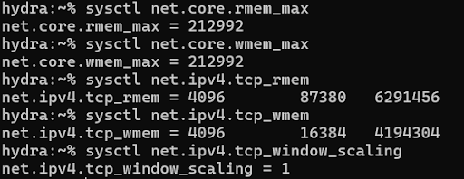
  <br>
  <em>Figure 7: Sunlab Network Buffer Sizes</em>
</p>

On the Sunlab machines, querying these values shows default limits (e.g., rmem_max and wmem_max both set to 212,992 bytes, with window scaling enabled). To optimize a system for high-throughput transfers, we need to execute commands like the following:

```bash
# Temporarily apply larger max buffer sizes (e.g., 16 MB)
sudo sysctl -w net.core.rmem_max=16777216
sudo sysctl -w net.core.wmem_max=16777216

# Tune TCP-specific memory limits (min, default, max in bytes)
sudo sysctl -w net.ipv4.tcp_rmem="4096 87380 16777216"
sudo sysctl -w net.ipv4.tcp_wmem="4096 65536 16777216"

# Ensure window scaling is enabled
sudo sysctl -w net.ipv4.tcp_window_scaling=1
```

<a id="sunlab_fin_timeout"></a>
<p align="center">
  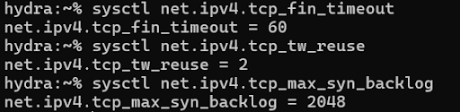
  <br>
  <em>Figure 8: Sunlab TCP FIN Timeout</em>
</p>

* **TCP Connection Setup Options:** We can also tune parameters that affect connection establishment and teardown to optimize how the OS handles high volumes of incoming or short-lived connections.
  * *TCP FIN Timeout:* This controls how long a socket remains in the `FIN-WAIT-2` state before being forcibly closed by the system. The Sunlab default is 60 seconds. Reducing this frees up memory resources faster on busy servers.  
  * *TCP Time-Wait Reuse:* Controlled via `net.ipv4.tcp_tw_reuse`, this allows the kernel to safely reuse sockets in the `TIME-WAIT` state for new outbound connections, which is important for clients handling thousands of rapid RPC requests. The Sunlab default was configured to a value of 2.
  * *SYN Backlog:* Controlled by `net.ipv4.tcp_max_syn_backlog`, this determines how many half-open connections (where the initial SYN is received but the handshake is incomplete) the kernel can hold in its queue. The Sunlab machines allocate 2048 slots. Increasing this helps prevent connection drops during traffic spikes or SYN flood attacks.
To optimize connection setup and teardown, we can use the following commands:

```bash
# Reduce FIN timeout to 15 seconds to free resources quickly
sudo sysctl -w net.ipv4.tcp_fin_timeout=15

# Enable safe reuse of TIME-WAIT sockets (1 = enabled)
sudo sysctl -w net.ipv4.tcp_tw_reuse=1

# Increase the maximum SYN backlog for heavy server loads
sudo sysctl -w net.ipv4.tcp_max_syn_backlog=8192
```

* **IRQ Balance and NUMA Settings:** On multi-CPU systems, the kernel attempts to optimize interrupt handling and memory access patterns. A background daemon called `irqbalance` is typically used to automatically distribute hardware interrupts (such as incoming network packets) across multiple CPU cores.

<a id="sunlab_irqbalance"></a>
<p align="center">
  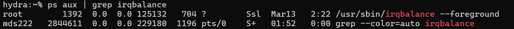
  <br>
  <em>Figure 8: Sunlab irqbalance Daemon</em>
</p>

Using the `ps aux | grep irqbalance` command on the Sunlab machines confirmed that the `irqbalance` daemon is actively running. While this automatic balancing is excellent for general workloads, dynamic load balancing can cause performance degradation in highly specialized environments due to CPU cache invalidation and context switching. For extremely low-latency applications, disabling `irqbalance` will improve performance. Doing so prevents the OS from moving interrupt processing between cores and allows us to manually bind network interrupts to specific, dedicated CPU cores.

### Operating System TCP Tuning
While tuning the operating system and socket parameters provides a strong foundation for high-performance networking, it will not provide significant improvemments if the network is fast and the application itself is not optimized for high performance networking. The design of the application dictates how efficiently network packets are handled. To maximize throughput and minimize latency, developers must structure their code to work synchronously with the underlying network stack. We touched upon few of the popular design choices we can make for high performance network applications:

* **Persistent Connections:** Establishing a TCP connection requires a costly three-way handshake, and closing it requires a four-way teardown. Rather than establishing new connections for each data exchange, maintain persistent connections using a Connection Pool. This amortizes the setup cost over thousands or millions of requests. In our RPC workload example, both the client and server implement persistent connections by keeping the socket open in a continuous loop to process all 100,000 transactions, rather than opening a new socket per request.

```cpp
// From the RPC Client Example: 
// The socket connects once, and is reused for the entire lifecycle of the workload
if (connect(sock, (struct sockaddr*)&serv_addr, sizeof(serv_addr)) < 0) {
    std::cerr << "TCP Connection Failed\n";
    return;
}

// Persistent loop utilizing the single open connection
for (uint32_t i = 0; i < TOTAL_TRANSACTIONS; i += BATCH_SIZE) {
  // ... send and receive operations ...
}
close(sock);
```

* **Memory Alignment:** Modern CPUs fetch memory according to the size of the cache line, typically 64 bytes in size. We should align the network message data structures to cache lines to reduce memory access overhead. If a network buffer or message struct crosses a cache line boundary, the CPU must perform multiple memory fetches to read a single entry. For high-performance computing tasks where millions of structs are serialized to network buffers, this unaligned access degrades performance. We can easily enforce this in C++ using the `alignas` specifier.

```cpp
// Optimizing the RPC SmallMessage struct for 64-byte cache line alignment
struct alignas(64) SmallMessage {
  uint32_t sequence_id;
  char payload_data[28];
  // The struct is exactly 32 bytes, ensuring two messages fit perfectly 
  // into a single 64-byte L1 cache line without crossing boundaries.
};
```

* **Zero-Copy Techniques and Scatter-Gather I/O:** Standard network operations copy data multiple times: from application memory to kernel space, and finally to the network card buffer. We can reduce memory copies to improve performance. One method is using the `readv` or `writev` system calls for scatter/gather I/O. Instead of copying multiple separate variables into one large contiguous application buffer before sending, `writev` allows the application to pass an array of pointers pointing to separate memory locations. The kernel then gathers these disjoint memory segments and sends them directly to the NIC, bypassing the intermediate user-space copy.

* **Optimizing Message Batching:** Sending small, frequent messages overwhelms the CPU with context switches between user and kernel space. Batching aggregates these small payloads into a single system call. However, we should carefully balance latency and throughput. A batch size that is too large forces early messages to wait too long before transmission, destroying real-time latency. A batch size too small fails to saturate the network throughput.

```cpp
// From the RPC Example: 
// Application-level batching to balance system call overhead and latency
const int BATCH_SIZE = 32;
std::vector<SmallMessage> request_batch(BATCH_SIZE);

// Aggregate messages into a single buffer
for (int j = 0; j < BATCH_SIZE; ++j) {
  request_batch[j].sequence_id = i + j;
  memset(request_batch[j].payload_data, 0x42, sizeof(request_batch[j].payload_data));
}

// Execute a single send() system call for 32 messages
send_request(sock, request_batch.data(), BATCH_SIZE * sizeof(SmallMessage));
```

To evaluate the impact of the application design strategies, we benchmarked the bulk transfer and RPC workloads after implementing persistent connections, memory alignment, and message batching.

#### Bulk Transfer Optimization Results

<a id="bulk_transfer_3"></a>
<p align="center">
  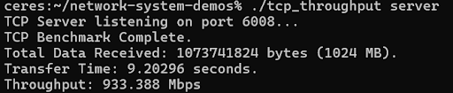
  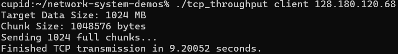
  <br>
  <em>Figure 9: Bulk Transfer of 1 GB Data Using TCP with Application-Level Optimizations</em>
</p>

For the bulk transfer, the client was configured to send 1024 MB of target data using an increased application-level chunk size of 1 MB. The transfer completed in 9.20052 seconds on the client side (9.20296 seconds on the server side), achieving a sustained throughput of 933.388 Mbps. When comparing these results to the earlier socket-level optimizations (which achieved ~933 Mbps), the performance remains virtually unchanged. The reason for this is physical network saturation. The underlying Gigabit Ethernet link has already reached the maximum bandwidth. While application-level optimizations—such as passing larger 1 MB chunks—reduce the number of `send()` system calls and save CPU cycles, they cannot force more bits across an already saturated network. In bulk data transfer scenarios, once the network pipe is fully saturated, further application-side CPU optimizations will not yield higher network throughput.

#### RPC Workload Optimization Results

<a id="rpc_3"></a>
<p align="center">
  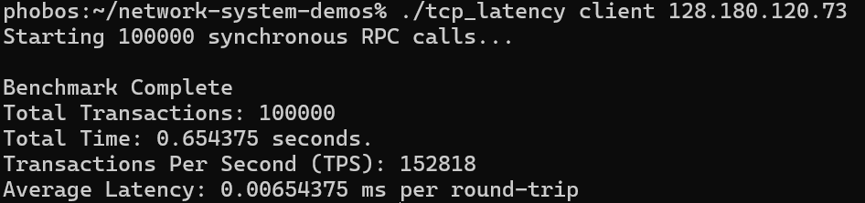
  <br>
  <em>Figure 10: 100K RPC Workload Using TCP with Application-Level Optimizations</em>
</p>

In stark contrast to the bulk transfer, the RPC workload experienced significant performance improvements. The optimized application processed 100,000 transactions using a batch size of 32. The entire workload completed in just 0.654375 seconds, improving the throughput to 152,818 Transactions Per Second (TPS). The average round-trip latency decreased to 0.00654375 ms. This shows a huge jump from the previous socket-optimized benchmark of ~5847 TPS. The primary reason of this improvement is message batching utilized over a persistent connection. By aggregating 32 smaller messages into a single system call, the application bypassed the overhead associated with continuous context switching between user space and the OS kernel space. Furthermore, enforcing memory alignment on the data structures ensured that the CPU could fetch and process the grouped data efficiently without unnecessary cache line reads. Because RPC workloads are traditionally bound by CPU processing and system call overhead rather than raw network bandwidth, structuring the application architecture to balance latency and throughput directly alleviates these bottlenecks.

## A Distributed System Example
To demonstrate the effects of these network optimizations in a realistic scenario, we deployed a distributed workload across a cluster of four Sunlab machines. In this topology, each node acts as both a client and a server. Every node spawns 6 client threads, and across these threads, each node attempts to send a total of 120,000 request messages to the other nodes in the cluster, waiting for an ACK for each. A distributed barrier coordinates the start and end times to ensure accurate benchmarking.

### Naive Implementation
The baseline implementation relies on standard, unoptimized POSIX socket calls and treats every single message as an isolated transaction. The client thread initiates a completely new TCP connection for every individual request. It establishes the 3-way handshake, sends the 1032-byte message using a standard `write()` system call, waits to `read()` the response, and then immediately tears down the connection using `close()`.

```cpp
// Naive Client Thread Baseline
for (int i = 0; i < MESSAGES_PER_THREAD; ++i) {
  // Open a new TCP connection for every message
  int sock = socket(AF_INET, SOCK_STREAM, 0);
  connect(sock, (struct sockaddr*)&serv_addr, sizeof(serv_addr));

  Message msg;
  msg.sender_id = my_node_id;
  msg.message_id = i;
  memset(msg.payload, 'A', sizeof(msg.payload));

  // Unoptimized delivery: 1 write per syscall
  write_exact(sock, &msg, sizeof(Message));
    
  Message response;
  read_exact(sock, &response, sizeof(Message));

  // Close connection immediately
  close(sock);
}
```

### Optimized Implementation
The optimized implementation overhauls the design by integrating memory alignment, socket-level tuning, persistent connections, and scatter/gather I/O.

* **Cache Line Alignment:** The `Message` struct is padded to exactly align with standard 64-byte CPU cache lines, preventing inefficient memory fetches.

```cpp
// Optimization 1: Memory Alignment
struct alignas(64) Message {
  int sender_id;
  int message_id;
  char payload[1024];
};
```

* **Persistent Connection Pool & Socket Tuning:** Instead of thrashing the network stack with thousands of handshakes, each client thread opens a single socket, connects once, and keeps it open. We tune this socket by disabling Nagle's algorithm and Delayed ACKs.

```cpp
// Optimization 2 & 4: Persistent Socket and Tuning
int sock = socket(AF_INET, SOCK_STREAM, 0);
connect(sock, (struct sockaddr*)&serv_addr, sizeof(serv_addr));

// Disable Nagle's Algorithm and Delayed ACKs
int opt = 1;
setsockopt(sock, IPPROTO_TCP, TCP_NODELAY, &opt, sizeof(opt));
setsockopt(sock, IPPROTO_TCP, TCP_QUICKACK, &opt, sizeof(opt));
```

* **Batching and Scatter/Gather I/O:** Rather than sending messages one by one, the application groups 100 messages together. Instead of copying these 100 structs into one massive intermediate application buffer, it uses the `writev` (gather) and `readv` (scatter) system calls. This allows the OS kernel to pull directly from the array of structs and push them to the network card in a single system call, bypassing user-space copies.

```cpp
// Optimization 3: Batching with Zero-Copy/Scatter-Gather I/O
Message msgs[BATCH_SIZE];
struct iovec iov[BATCH_SIZE];
size_t batch_bytes = sizeof(Message) * BATCH_SIZE;

for (int b = 0; b < num_batches; ++b) {
  // ... populate msgs array ...
  
  // Gather Write: Send 100 messages in one syscall
  reset_iovec(iov, msgs, BATCH_SIZE);
  writev_exact(sock, iov, BATCH_SIZE, batch_bytes);

  // Scatter Read: Receive 100 responses in one syscall
  reset_iovec(iov, msgs, BATCH_SIZE);
  readv_exact(sock, iov, BATCH_SIZE, batch_bytes);
}
```

### Benchmark Results

<a id="naive_dist_system"></a>
<p align="center">
  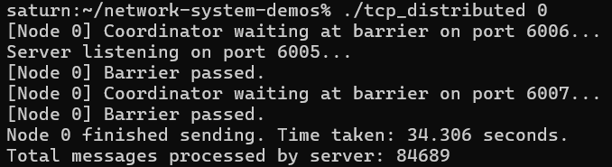
  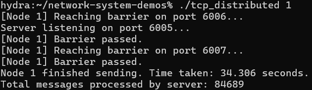
  <br>
  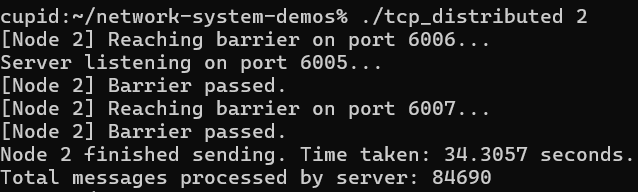
  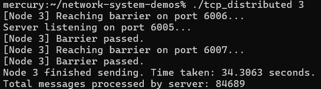
  <br>
  <em>Figure 10: Naive implementation performance across four nodes in a distributed system</em>
</p>

The naive system took approximately 34.3 seconds to complete its execution phase. The server logs indicate that each node only successfully processed between 84,689 and 84,690 messages—meaning roughly 30% of the network traffic was completely lost. Because the application rapidly opened and closed sockets for every single message, it quickly exhausted the operating system's ephemeral port range and overwhelmed the `TIME-WAIT` and `SYN backlog` queues. The kernel simply could not tear down the sockets fast enough, leading to dropped connections and failed message deliveries. This is an example of TCP connection thrashing.

<a id="optimized_dist_system"></a>
<p align="center">
  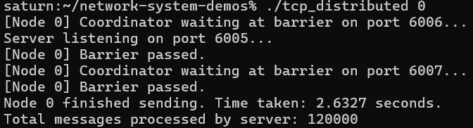
  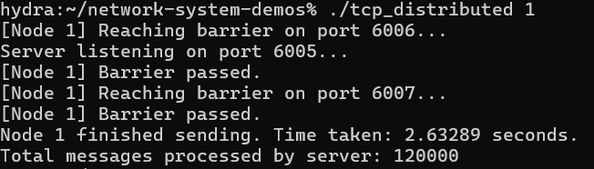
  <br>
  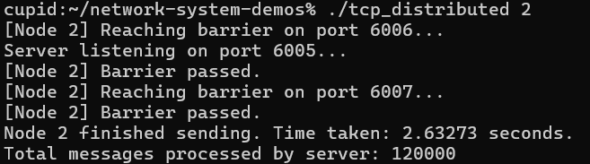
  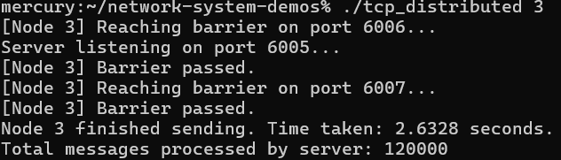
  <br>
  <em>Figure 11: Optimized implementation performance across four nodes in a distributed system</em>
</p>

The optimized system completed the exact same workload in roughly 2.63 seconds. Furthermore, every single node processed exactly 120,000 messages. By utilizing persistent connections, we eliminated the connection overhead and backlog exhaustion. Application batching combined with `writev`/`readv` drastically reduced the total number of system calls and context switches, while `TCP_NODELAY` and `TCP_QUICKACK` ensured the payloads were not stalled in the kernel's queue. The combination of these strategies resulted in a system that is roughly 13 times faster and strictly reliable.


## Motivation for RDMA
From our discussion so far, traditional network protocols force a trade-off between reliability and performance. UDP provides minimal overhead and fast execution but lacks the flow control, congestion control, and guaranteed delivery required by stateful distributed applications. Conversely, TCP ensures strict, in-order packet delivery but introduces latency and throughput bottlenecks due to its heavy reliance on the operating system's kernel. The performance limitations of TCP arise from three main sources:

* **Context Switching Overhead:** Every standard `send()` and `recv()` operation in TCP requires a system call, forcing the processor to switch back and forth between user space and kernel space. In high-throughput RPC workloads, this continuous state switching consumes thousands of CPU cycles per transaction, increasing latency.

* **Redundant Memory Copies:** Standard TCP requires data to be copied multiple times before it ever leaves the machine. For a basic send operation, data is copied from the application's user-space memory buffer into the kernel's socket buffer, and finally transferred to the NIC.

* **CPU Interrupt Processing:** When a standard TCP packet arrives, the NIC generates a hardware interrupt. This forces the CPU to halt active processing, handle the packet, traverse the complex TCP state machine, compute checksums, and generate an acknowledgment. Under heavy network loads, the CPU spends more time processing the network stack than executing the actual application logic.

While our previous application-level optimizations (such as batching and scatter/gather I/O) mitigate these issues by reducing the frequency of system calls, they do not eliminate the kernel from the data path. The performance ceiling is still dictated by the OS.

RDMA completely rearchitects how data is transmitted by shifting the transport layer logic from the software kernel directly onto specialized networking hardware, known as an RNIC (RDMA-enabled NIC). This solves the limitations of both TCP and UDP through three core mechanisms:

* **Kernel Bypass:** After the initial connection is established, the application data path entirely bypasses the operating system. The application posts read and write work requests directly to hardware queues managed by the RNIC. No system calls are made during data transmission.

* **True Zero-Copy Networking:** The RNIC utilizes direct memory access to read data directly from the sender's registered user-space memory and write it directly into the receiver's user-space memory over the network. Intermediate kernel buffers are eliminated.

* **Asynchronous CPU Offload:** Because the hardware handles all packet segmentation, reassembly, congestion control, and reliability guarantees (when operating in Reliable Connection mode), the host CPU is entirely freed from network processing tasks.

By delivering the strict reliability guarantees of TCP via a hardware-accelerated, kernel-bypassing architecture, RDMA achieves sub-microsecond latencies. This hardware offloading makes it the standard for data-intensive applications.

# Lecture 2: Remote Direct Memory Access (RDMA)

*CSE 498 — Alex Clevenger, Rishad Islam, Reilly Yankovich*

---

## What is RDMA?

RDMA (Remote Direct Memory Access) enables direct memory access between machines over a network, bypassing the OS and CPU on the remote side. Setting up RDMA connections is non-trivial and requires careful orchestration of multiple steps:

- Establish a protection domain
- Register memory regions
- Allocate Completion Queues (CQs)
- Create Queue Pairs (QPs)
- Exchange addresses and rkeys
- Transition QP states

Hardware-enforced ordering exists within a single QP, but not across different QPs. RDMA memory must be **pinned** (registered with the NIC) so that the NIC can safely DMA to/from it without the OS paging it out.

This complexity motivates RDMA libraries such as **Remus**, which streamline the setup process.

---

## Transport Types: RC vs. UD

### Reliable Connection (RC)

Analogous to TCP. RC provides:

- **One-to-one** connection semantics
- Support for one-sided operations (READ, WRITE, CAS)
- Per-connection state tracked by the rNIC, which creates a practical constraint on available NIC resources:
  - **ICM (Interconnect Context Memory):** stores QP context and other control structures
  - **MTT (Memory Translation Table) cache:** holds address translations for registered RDMA memory regions

### Unreliable Datagram (UD)

Analogous to UDP. UD provides:

- **One-to-many** semantics
- Lighter connection overhead
- Best-effort delivery with no ordering guarantees
- Limited to Send/Recv — **does not support one-sided operations**

---

## Operation Types: One-sided vs. Two-sided

### One-sided Operations

The remote CPU is entirely uninvolved — zero CPU cycles are consumed on the remote side.

- Supports: **Read, Write, CAS**
- Requires **Reliable Connected (RC)** transport
- Remote memory must be pre-registered with known addresses and rkeys

### Two-sided Operations

The remote CPU is actively involved.

- The receiver must post a Receive Work Request (RWR) to its Receive Queue (RQ) ahead of time
- The receiver must also poll its CQ to know when a SEND has arrived
- Works with both RC and UD
- The receiver does not need to know the sender's memory layout — no remote address specification required

---

## Zero-Copy Operations

A key consideration in RDMA design is avoiding unnecessary data copies. Consider the following two approaches:

```cpp
// Approach 1: Copy into RDMA buffer inside Write()
T obj(some_data);
compute_thread->Write(laddr, raddr, obj, wr_id);

// Approach 2: Write directly into registered buffer, then issue RDMA
*reinterpret_cast<T *>(laddr.addr + laddr.offset) = obj;
compute_thread->Write(laddr, raddr, wr_id);
```

Approach 2 is a **zero-copy** pattern — the object is written directly into the pre-registered memory region, avoiding an intermediate copy. This reduces memory bandwidth and latency.

---

## Thread-to-QP Relationships

Since ordering is enforced per-QP, the mapping between threads and QPs is an important design decision. Common patterns include:

- **One-to-One:** each thread owns a dedicated QP
- **Round-robin:** threads distribute work across QPs
- **Random:** threads pick QPs randomly
- **QP-sharing:** multiple threads share a QP — requires explicit coordination and is likely to introduce synchronization overhead
 - After further clarification, kindly note that `ibv_post_send` and `ibv_poll_cq` are **thread-safe**
  - Thus, multiple threads can push elements to the SQ or CQ without needing additional synchronization 
    - Other considerations: cache bouncing, contention on the QP-spinlock 
---

## System Design & Tunable Parameters

### Memory Disaggregation

Disaggregating memory is particularly well-suited for one-sided operations. Since one-sided RDMA does not involve the remote CPU, a memory node can use a cheap CPU without sacrificing performance.

### Staging Buffers

The size of staging buffers and landing space is a key tunable. These buffers must be RDMA-registered because the NIC needs stable, pinned physical addresses for DMA.

---

## RDMA Optimizations

### Completion Batching

Rather than polling for completions after every individual operation, completions can be batched — reducing the overhead of CQ polling and increasing throughput.

### Doorbell Batching

Multiple work requests can be posted before ringing the NIC's doorbell, reducing the number of costly MMIO writes to the NIC.

### Shared Completion Queue (CQ)

Multiple QPs can share a single CQ, reducing resource consumption and simplifying polling. A potential adverse effect is that a single slow QP can delay processing of completions from faster QPs.

### Memory & Layout Optimizations

- **Huge pages:** drastically reduce TLB misses for registered memory regions
- **Cache-aligned staging buffers:** improve CPU cache efficiency
- **Prefetching:** reduce cache miss latency in the data path
- **Inlining payloads:** small payloads can be inlined into the WQE, avoiding an additional DMA fetch from host memory

### Other Optimizations

- **Relax ordering:** eliminate `IBV_SEND_FENCE` where strict ordering is not required
- **Eliminate signaling for WRITEs:** suppress completion events for operations that don't need them, reducing CQ traffic
- **Arm the CQ (`ibv_req_notify_cq`):** switch to an event-driven model instead of busy-polling, freeing CPU cycles

---

## Remus

Remus is an RDMA library developed and maintained by the **Scalable Systems and Software (SSS) group at Lehigh University**. Its objectives are:

- **Streamline connection setup** — abstracting the multi-step RDMA initialization process
- **Programmability** — providing a clean, usable API for RDMA-based systems
- **Performance** — enabling low-latency, high-throughput distributed applications

---

## Ongoing Work: Fibers

A fiber is a lightweight unit of execution that runs entirely in user space, without OS involvement. Compared to traditional threads:

| | Threads | Fibers |
|---|---|---|
| Context switch cost | 1–5 µs | 10–100 ns |
| Scheduling | OS-managed | User-managed |
| Overhead | Higher | Much lower |

Fibers are being explored in ongoing work to further reduce per-operation overhead in RDMA-based systems by replacing OS-scheduled threads with cooperative, user-space switching.

---

## Citations

- [Optimizing TCP for High-Performance Applications: An HFT Developer's Guide](https://dev.to/sid_hattangadi/optimizing-tcp-for-high-performance-applications-an-hft-developers-guide-1212)
- Slides 3–6, 19–20 by Amanda Baran, SPAA '25
- Slide 29: [Demystifying RDMA — LinkedIn post by Ravichandran Paramasivam](https://www.linkedin.com/posts/ravichandran-paramasivam-a12b3438_demystifying-rdma-from-sockets-to-zero-copy-share-7394351876416143360-UnQK/)
